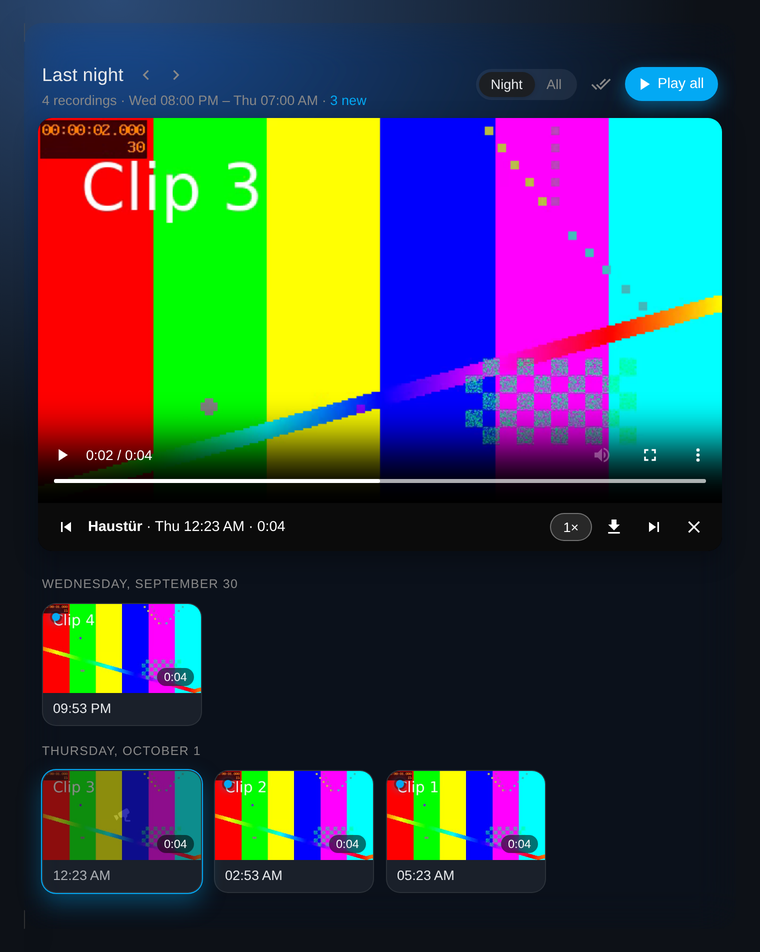

# Surveillance Station Recordings

Bring your Synology Surveillance Station **recordings** into Home Assistant: a dashboard card that shows what was recorded last night, with thumbnails, one-tap playback and a "play all" mode for a quick morning review.

The built-in Synology DSM integration only exposes live streams. Event lists and recorded clips stay locked inside Surveillance Station. This integration fills that gap.



## Features

- **Morning review card**: opens on last night (20:00–07:00, adjustable). Arrows step back through earlier nights, a switch shows all recordings.
- **Summary line**: "4 events last night · between 22:14 and 05:44 · 3 not watched yet". Tap it to play them, dismiss it once checked.
- **Play all**: plays unseen clips back to back, at 1×, 2× or 4× speed. Unseen clips are marked.
- **Visual editor**: every setting of the card can be changed in the dashboard editor, no YAML needed.
- **No duplicate storage**: clips are streamed from Surveillance Station when you play them. Only small thumbnails are kept. If Home Assistant runs on the NAS, it can read the recordings straight from disk.
- **Download**: save any clip as an MP4 with camera name and time in the file name.
- **Works everywhere**: clips are served by Home Assistant itself through signed URLs, so they play in the browser, the companion app and over your VPN without exposing DSM.
- **Glass look**: translucent, blurred card that picks up the colors of your theme, in light and dark.
- **Per-camera sensors** and an **automation event** for every new clip.
- Everything stays local. No cloud, no third-party service.

## Requirements

- Synology NAS with Surveillance Station
- Home Assistant 2025.4 or newer
- `ffmpeg` available to Home Assistant for thumbnails (included in the official container and HA OS)

## Installation

### HACS

1. HACS → three-dot menu → **Custom repositories**
2. Add `https://github.com/ma-2a/ss-recordings`, category **Integration**
3. Install **Surveillance Station Recordings** and restart Home Assistant

### Manual

Copy `custom_components/ss_recordings` into your `config/custom_components/` folder and restart Home Assistant.

## Setup

### 1. Create a DSM user

Use a dedicated account instead of your admin:

1. DSM → Control Panel → User & Group → create user `homeassistant`
2. Do **not** enable 2-step verification for this user
3. Surveillance Station → Privilege Settings: give the user a profile with access to the cameras you want and permission to **play back** and **download** recordings

An existing admin account works too, as long as it has no 2-step verification.

### 2. Add the integration

Settings → Devices & services → **Add integration** → *Surveillance Station Recordings*

| Field | Example |
| --- | --- |
| Host | `192.168.178.20` |
| Port | `5001` (HTTPS) or `5000` (HTTP) |
| Use HTTPS | on |
| Verify SSL certificate | off for a self-signed certificate |

If Home Assistant runs on the same NAS, use the NAS's LAN IP.

After a minute each camera shows up as a device with a "Recordings (24h)" sensor, and thumbnails are created in the background.

### 3. Add the card

Set up the integration first: the card is delivered by the integration and only exists once it is running. Then reload the browser (Cmd/Ctrl + Shift + R) and add the card to a dashboard. Search for **Surveillance Station Recordings** in the card picker, or use the manual card:

```yaml
type: custom:ss-recordings-card
```

Everything below can be set in the visual editor. After updating the integration, reload the browser once so the new card version is used.

#### What the card shows

- **Night** (default): before the night ends, the night in progress; afterwards, the night that just ended. With the default 20:00–07:00 you see last night at 7:30 in the morning and still at 22:00 in the evening. The arrows next to the title step to earlier nights.
- **All**: every recording within the integration's time window (48 hours by default).

Above the clips a summary line sums up the night, for example *4 events last night · between 22:14 and 05:44 · 3 not watched yet*. Tap it to jump to that night and play the unwatched clips. The × hides it until the next night. By default it only appears while there are unwatched clips; it can also be shown always, never, or only during a time window such as 06:00–12:00.

Click a thumbnail to play it. **Play all** starts with the first unseen clip and continues automatically. "Seen" and dismissed summaries are stored per browser.

#### Card options

| Option | Default | Description |
| --- | --- | --- |
| `default_view` | `night` | View when the card opens: `night` or `all` |
| `night_start` | `"20:00"` | Start of the night |
| `night_end` | `"07:00"` | End of the night |
| `show_toggle` | `true` | Show the Night / All switch |
| `summary` | `unseen` | Summary line: `unseen` (only with unwatched clips), `always` or `never` |
| `summary_from` | – | Only show the summary line from this time, e.g. `"06:00"` |
| `summary_until` | – | Only show the summary line until this time, e.g. `"12:00"` |
| `cameras` | all | Only show these cameras, e.g. `[Front door]` |
| `title` | automatic | Fixed title for the default night. Empty: "Last night", "Tonight" or the date |
| `variant` | `glass` | `glass` or `plain` (normal Home Assistant card) |
| `tile_size` | `medium` | `small`, `medium` or `large` |
| `order` | `oldest` | `oldest` or `newest` first |
| `max_height` | `0` | Maximum height in pixels, the list scrolls inside. `0` = no limit |
| `show_camera` | `false` | Always show the camera name on tiles (shown automatically with several cameras) |
| `speed` | `1` | Initial playback speed: `1`, `2` or `4` |
| `autoplay_next` | `true` | Continue with the next clip when one ends |
| `show_download` | `true` | Show the download button in the player |

```yaml
type: custom:ss-recordings-card
night_start: "22:00"
night_end: "06:30"
cameras:
  - Front door
tile_size: small
speed: 2
```

#### Appearance

The card is translucent and blurs whatever is behind it, so it works best on a dashboard with a background image or a colored theme. On a plain white background the effect is barely visible — `variant: plain` then gives the normal card look.

Four CSS variables control the look. Set them in your theme (`themes.yaml`) to apply them to every instance of the card:

```yaml
my-theme:
  ss-recordings-accent: "#ff9f0a"   # buttons, markers, highlight
  ss-recordings-radius: 22px        # corner radius
  ss-recordings-blur: 26px          # blur strength behind the card
  ss-recordings-tint: "#101522"     # tint of the glass surface
```

Without these the card uses your theme's accent color and card background.

## Integration options

Settings → Devices & services → Surveillance Station Recordings → **Configure**

| Option | Default | Description |
| --- | --- | --- |
| Keep recordings from the last | 48 h | Window of recordings loaded from Surveillance Station. The "All" view can't look further back than this. |
| Create thumbnails in the background | on | Small JPEG previews, stored in `config/ss_recordings/`. |
| Keep full clips on disk | off | Off: clips are streamed when played and nothing is stored. On: clips are cached for instant replay. |
| Local cache size | 2000 MB | Upper limit when full clips are kept. Oldest clips are removed first. |
| Surveillance folder inside the container | – | Read clips directly from disk instead of through the API, see below. |

Recording deletion and retention are still handled by Surveillance Station.

### Reading recordings directly from disk

If Home Assistant runs as a container on the same Synology, it can read the recording files directly. Nothing is downloaded or copied, and seeking is instant.

1. Container Manager → your Home Assistant container → **Stop** → **Edit** → **Volume Settings** → **Add Folder**
2. Choose the shared folder `surveillance`, mount path `/surveillance`, and tick **Read-only**
3. Save and start the container
4. Integration options → **Surveillance folder inside the container**: `/surveillance`

If you use `docker compose`, add `- /volume1/surveillance:/surveillance:ro` to the volumes of the Home Assistant service.

## Automations

Morning push with the number of clips per camera:

```yaml
automation:
  - alias: Morning camera summary
    triggers:
      - trigger: time
        at: "07:00:00"
    actions:
      - action: notify.mobile_app_phone
        data:
          title: "Overnight"
          message: >
            Front door: {{ states('sensor.front_door_recordings_24h') }} clips
          data:
            url: /lovelace/cameras
```

React to every new clip:

```yaml
triggers:
  - trigger: event
    event_type: ss_recordings_new_recording
    event_data:
      camera_name: Front door
```

Event data: `id`, `camera_id`, `camera_name`, `start`, `stop`, `duration`, `reason`, `entry_id`.

## How it works

The integration logs into DSM with a dedicated Surveillance Station session, polls `SYNO.SurveillanceStation.Recording` every minute and streams clips via the same API (or reads them from the mounted surveillance folder). Home Assistant serves them from `/api/ss_recordings/...` behind its own authentication. The card talks to the integration over the websocket API.

## Troubleshooting

- **Invalid credentials**: check the password and make sure 2-step verification is off for this user.
- **Surveillance Station did not answer**: the package must be running and the user needs Surveillance Station access.
- **No thumbnails**: `ffmpeg` is missing. Playback still works.
- **Clip does not play in the browser**: the browser can't decode the camera's codec. H.264 works everywhere. H.265 plays in Safari and in some Chromium builds. Switch the camera's stream to H.264 if needed.
- **"Custom element doesn't exist: ss-recordings-card"**: the integration is not set up yet, or the browser still has an old page cached. Set up the integration, then reload with Cmd/Ctrl + Shift + R. In the companion app: Settings → Companion app → Troubleshooting → Reset frontend cache.
- **Card shows an old version after an update**: same as above, reload without cache. Do not add the card file as a dashboard resource manually; the integration loads it.
- **Card shows no recordings although Surveillance Station has some**: check that the DSM user may play back the camera in Surveillance Station's privilege settings. Then open the integration, use the three-dot menu → **Download diagnostics** and attach the file to an issue. It contains the raw answer from Surveillance Station (host, user and paths are removed).

Enable debug logging:

```yaml
logger:
  logs:
    custom_components.ss_recordings: debug
```

## License

MIT
